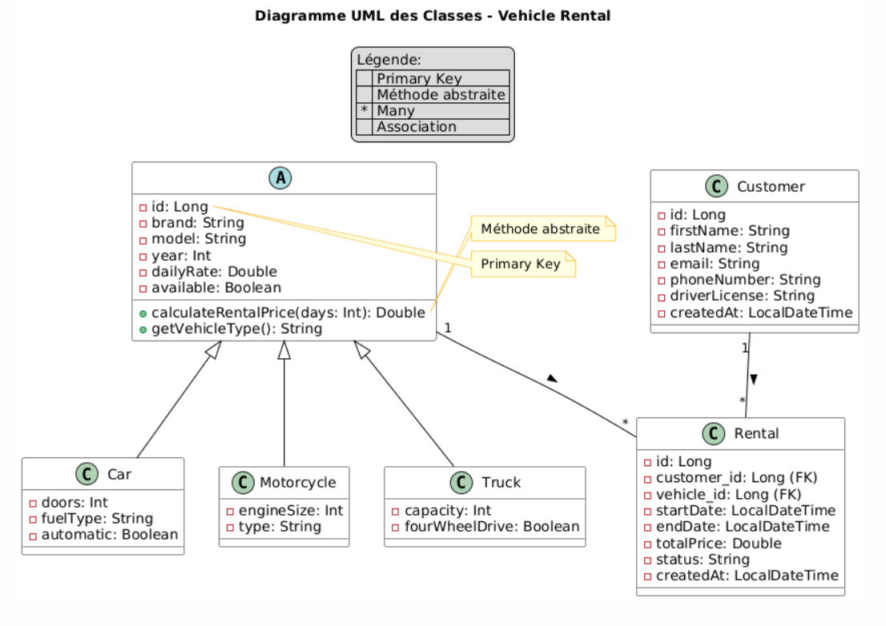
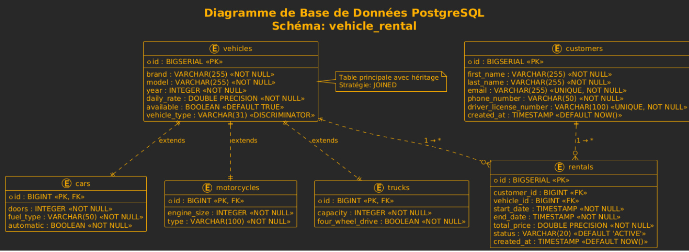
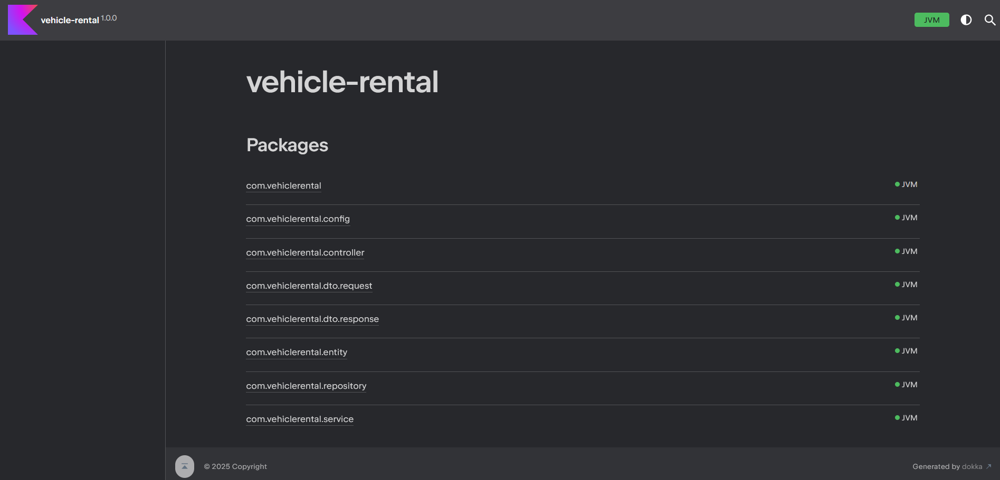

Package
# 🚘🏍️🚛 Gestion De Location Des Vehicules Back End
## 📝 Description
Ce projet est une **API RESTful complète** développée en **Kotlin avec Spring Boot** et documentée avec **Swagger UI** pour la gestion d'un système de location de véhicules. L'application permet de gérer l'ensemble du cycle de location, depuis la gestion du parc automobile jusqu'à la facturation des clients.
- **Langage** : Kotlin
- **Framework** : Spring Boot
- **Base de données** :PostgreSQL
- **Build Tool** :  Gradle
## 📊 Diagramme UML

## 🗃 Structure de la Base de Données

## 🚀 Installation et Exécution
### Prérequis
- JDK 17+   
- MySQL/PostgreSQL installé
- Maven/Gradle
- ### Étapes d'installation
1. Clonez le repository
```bash
 git clone https://github.com/StailiSaad/GESTION-DE-LOCATION-DE-VEHICULES-BACK-END
```
2. Créez la base de données
```sql
 CREATE DATABASE vehicle_rent;
```
3. Configurez `application.properties`
```properties
spring.application.name=vehicle-rental-backend
spring.datasource.url=jdbc:mysql://localhost:8081/vehicle_rent
spring.datasource.username=votre_username
spring.datasource.password=votre_password
 
```
4. Lancez l'application
```bash
 ./mvnw spring-boot:run
```
## 📚 Documentation du Code

### A) Description
Ce projet dispose d'une documentation complète générée automatiquement à partir des commentaires KDoc présents dans le code source.

### B) Générer la documentation
*Avec Gradle :*
```bash
./gradlew dokkaHtml
```
### C) Consulter la documentation
Après génération, ouvrez le fichier suivant dans votre navigateur :
- *Gradle* : build/dokka/index.html

### D) Contenu de la documentation
La documentation inclut :
- ✅ Description détaillée de toutes les classes (Entités, Services, Controllers, Repositories)
- ✅ Explication de toutes les méthodes publiques avec paramètres et valeurs de retour
- ✅ Documentation des exceptions levées
- ✅ Relations entre les différents composants
- ✅ Exemples d'utilisation pour les fonctions complexes

### E) Navigation
La documentation générée est interactive et permet de :
- 🔍 Rechercher rapidement une classe ou méthode
- 🔗 Naviguer entre les classes liées
- 📱 Consulter depuis mobile (design responsive)
- 📊 Visualiser la hiérarchie des packages

## 📡 Endpoints Disponibles

### A) 🚗 Gestion du Parc Automobile

| Méthode | Endpoint | Description | Code Réponse |
|---------|----------|-------------|--------------|
| `GET` | `/api/vehicles` | Catalogue complet des véhicules | 200 OK |
| `GET` | `/api/vehicles/available` | Véhicules disponibles à la location | 200 OK |
| `GET` | `/api/vehicles/{id}` | Détails d'un véhicule spécifique | 200 OK |
| `GET` | `/api/vehicles/search` | Recherche multicritères | 200 OK |
| `POST` | `/api/vehicles/cars` | Ajout d'une automobile au parc | 201 Created |
| `POST` | `/api/vehicles/motorcycles` | Enregistrement d'une motocyclette | 201 Created |
| `POST` | `/api/vehicles/trucks` | Intégration d'un poids lourd | 201 Created |
| `PATCH` | `/api/vehicles/{id}/availability` | Mise à jour de la disponibilité | 200 OK |
| `DELETE` | `/api/vehicles/{id}` | Retrait du parc automobile | 204 No Content |

### B) 👥 Administration des Clients

| Méthode | Endpoint | Description | Code Réponse |
|---------|----------|-------------|--------------|
| `GET` | `/api/customers` | Portefeuille clients complet | 200 OK |
| `GET` | `/api/customers/{id}` | Profil client détaillé | 200 OK |
| `GET` | `/api/customers/search` | Recherche nominative | 200 OK |
| `POST` | `/api/customers` | Enregistrement nouveau client | 201 Created |
| `PUT` | `/api/customers/{id}` | Mise à jour profil client | 200 OK |
| `DELETE` | `/api/customers/{id}` | Archivage client | 204 No Content |

### C) 📄 Gestion des Contrats de Location

| Méthode | Endpoint | Description | Code Réponse |
|---------|----------|-------------|--------------|
| `GET` | `/api/rentals` | Historique des locations | 200 OK |
| `GET` | `/api/rentals/{id}` | Détails d'un contrat | 200 OK |
| `GET` | `/api/rentals/customer/{customerId}` | Historique client | 200 OK |
| `GET` | `/api/rentals/overdue` | Locations en retard | 200 OK |
| `POST` | `/api/rentals` | Création nouveau contrat | 201 Created |
| `POST` | `/api/rentals/{id}/complete` | Clôture de location | 200 OK |
| `POST` | `/api/rentals/{id}/cancel` | Annulation de contrat | 200 OK |

## 🚀 Améliorations Techniques Implémentées

### A) Architecture DTO (Data Transfer Object)

**Problématique Résolue** :  
Séparation stricte entre le modèle de persistance et le modèle d'exposition API pour éviter les failles de sécurité et améliorer les performances.

**Avantages** :
- ✅ **Contrôle granulaire** des données exposées
- ✅ **Prévention des injections** de données sensibles
- ✅ **Découplage** entre couches applicatives
- ✅ **Optimisation** du trafic réseau

### B) Documentation Interactive avec Swagger/OpenAPI 3.0

**Solution de Documentation** :  
Intégration de la spécification OpenAPI 3.0 pour une documentation automatique et interactive de l'API.

**Fonctionnalités** :
- 📚 **Génération automatique** de la documentation
- 🖱️ **Interface utilisateur interactive** (Swagger UI)
- 🧪 **Testing en temps réel** des endpoints
- 🔒 **Validation des schémas** de données
- 🛡️ **Sécurisation de l'accès** à la documentation

**Accès** :
- 🌐 **Interface Utilisateur** : `http://localhost:8081/swagger-ui.html`
- 📄 **Spécification OpenAPI** : `http://localhost:8081/api-docs`

### C) Suite Complète de Tests Unitaires 

**Stratégie de Testing** :  
Implémentation du "Arrange-When & Then" → Mélange hybride entre AAA et BDD avec isolation des dépendances via Mockito.
## 🎥 Démonstration Vidéo

[](https://teams.live.com/l/message/19:y2jNSHtO15kryJakqVMFL1bFiSY7a-8jn67xlAHscXs1@thread.v2/1762030790084?tenantId=9188040d-6c67-4c5b-b112-36a304b66dad&groupId=c8c90000-906e-f71a-0000-000000000000@84df9e7f-e9f6-40af-b435-aaaaaaaaaaaa&parentMessageId=1762030790084&teamName=Vid%C3%A9o%20D%C3%A9monstration%20Github&channelName=General&createdTime=1762030790084&owningTeamId=19%3Ay2jNSHtO15kryJakqVMFL1bFiSY7a-8jn67xlAHscXs1%40thread.v2)

**Cliquez sur le badge ci-dessus pour accéder à la démonstration vidéo sur Microsoft Teams**

### 📹 Contenu de la démonstration :
- 🚀 **Lancement de l'application**
- 📄 **Structure de code dans Intellij**
- 🔄 **Tests des endpoints API**
- 📊 **Interface Swagger UI**
- 👥 **Conclusion**

## 📅 Date
**01/11/2025**
## 󰞵 Auteur
**Staili Saad et Saadi Sara** - Projet Back-End **Kotlin/Spring Boot** documentée avec **Swagger UI**